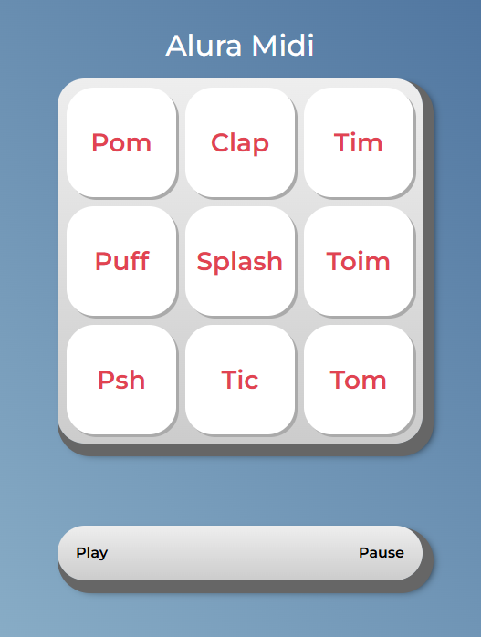

# Alura MIDI 🎵

Alura MIDI é um **player de áudios em sequência** feito em **JavaScript**, inspirado em aulas da Alura. O player permite tocar vários áudios um de cada vez, com **botões Play e Pause**, garantindo que apenas um som toque por vez. Projeto criado como estudo e portfólio.

## Tecnologias utilizadas

- HTML5
- CSS3
- JavaScript (ES6+)

## Funcionalidades

- Cada áudio é reproduzido individualmente ao clicar na tecla correspondente. 
- Reproduz áudios em sequência com o botão **Play**.  
- Botão **Pause** interrompe todos os áudios e reinicia a sequência.

## Preview

  

